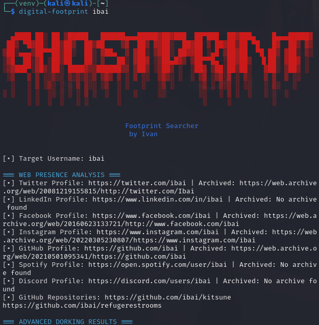
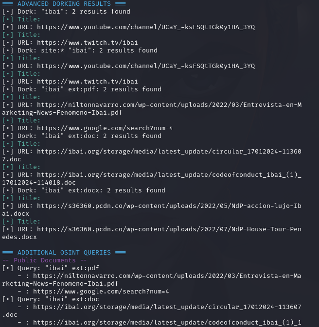

# Digital Footprint Scanner
Digital Footprint Scanner is a free tool that extracts useful information from an email address or username. It gathers data on domain intelligence, email intelligence, web presence analysis, and advanced dorking results. The tool provides detailed output that includes domain registration details, DNS records, open ports, public documents, social media profiles, and more.
<p align="center">
  
</p>


## Features

- **Domain Intelligence:** Retrieves target domain details such as registrar information, creation dates, DNS records, and open ports.
- **Email Intelligence:** Checks for associated Gravatar, data breaches, and more.
- **Web Presence Analysis:** Searches for social media profiles (Twitter, LinkedIn, Facebook, Instagram, GitHub, Spotify, Discord) and queries archive data.
- **Advanced Dorking:** Performs OSINT queries to find public documents, phone numbers, password leaks, and additional web intelligence.
- **Additional OSINT Queries:** Uses advanced Google search dorks to gather further information like IP/domain data and deleted content.

## Installation

### 1. Create a Virtual Environment

We recommend using a virtual environment to manage dependencies. To create and activate one, run the following commands:

```bash
# Create a virtual environment (replace "venv" with your preferred name)
python3 -m venv venv

# Activate the virtual environment (Linux/macOS)
source venv/bin/activate

# On Windows, use:
# venv\Scripts\activate
```
## 2. Install Digital Footprint Scanner

Install the package using pip. **Note:** The tool works perfectly with version **1.6.9**. If you already have another version installed, uninstall it and then install version 1.6.9.

```bash
pip install digital-footprint
```
To ensure you have version 1.6.9:
```bash
# Check the installed version
pip show digital-footprint
# If the version is not 1.6.9, uninstall and reinstall:
pip uninstall digital-footprint
pip install digital-footprint==1.6.9
```

## 3. Install Dependencies
The package requires the following dependencies:
requests
beautifulsoup4
python-whois
dnspython
waybackpy
colorama
googlesearch-python
If these are not automatically installed with the package, install them manually:
```bash
pip install requests beautifulsoup4 python-whois dnspython waybackpy colorama googlesearch-python
```

## 4. Usage
Once installed, you can run the tool from the command line using one of the following commands:

To scan by email:
```bash
digital-footprint your.email@example.com
```
To scan by username:
```bash
digital-footprint username
```
## Troubleshooting
### Version Issues
If you encounter any issues with the tool not working as expected, verify that you are using version 1.6.9. 
```bash
# Use pip show digital-footprint to check the installed version and reinstall as shown above if necessary.
pip show digital-footprint
```
### Dependencies
Ensure all required dependencies are installed. You can install any missing packages with pip.

Happy scanning!

## Example Output
<p align="center">
  
  
</p>
